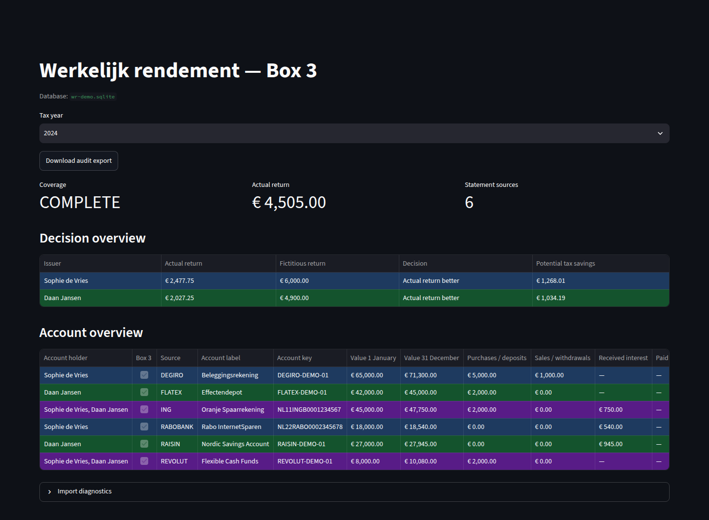

# Werkelijk Rendement

_Reconstruct and compare Dutch Box 3 returns from your own financial statements._

Werkelijk Rendement is a local Python application that reads supported annual
bank, broker, and Dutch income-tax PDFs. It reconstructs actual return
(`werkelijk rendement`), compares it with the filed fictitious return
(`forfaitair rendement`), and produces an auditable ZIP export.

The included Streamlit dashboard summarizes coverage, return calculations, tax
outcomes, and the account-level source data behind them. Processing stays on your
machine.



## Supported institutions

The current allowlist covers statements from **ING, Rabobank, SNS, Raisin,
Revolut, DEGIRO, flatex, and the Belastingdienst**. Only recognized annual
statement layouts are imported; unsupported PDFs are skipped rather than guessed.

See [Supported documents](docs/supported-documents.md) for the exact statement
names, required content markers, and known limitations. Support for other banks,
brokers, or layouts can be added through pull requests.

## Requirements

- Python 3.10 or newer
- Optional but recommended: Poppler's `pdftotext` executable for more reliable
  layout-preserving extraction. The tool falls back to `pypdf`.

## Quickstart

### 1. Install the application

From a checkout of this repository:

```bash
python3 -m venv .venv
source .venv/bin/activate
python -m pip install -e .
```

### 2. Try the dashboard with example data

```bash
wr demo
```

This creates a temporary database with entirely synthetic financial data for
Sophie de Vries and Daan Jansen, then opens the populated dashboard. Nothing is
imported from your computer, and the demo data is removed when the process stops.

### 3. Configure your workspace (optional)

No configuration file is required when you pass the statement directory to the
import command. For persistent paths, partner aliases and other configuration settings, start from the example:

```bash
cp config.example.toml config.toml
```

Relative database paths are resolved from the configuration file. Use a different
file with `wr --config /path/to/config.toml <command>`.

### 4. Import your documents

```bash
wr import --root /path/to/your/pdf-statements
```

The importer scans recursively, admits only supported PDF layouts, deduplicates
documents by content hash, and writes the analysis to `data/wr.sqlite` by default.

### 5. Open your dashboard

```bash
wr dashboard
```

Streamlit opens the local dashboard in your browser. Use
`wr dashboard --port 8501` to select a different port.

## Other commands

```bash
wr import --fresh               # rebuild the configured database from scratch
wr recompute                    # recompute existing imported facts
wr export --year 2024           # write exports/wr-audit.zip
```

Run `wr <command> --help` for all options. After changing source or parser rules,
use `wr import --fresh` so previously admitted rows cannot affect the result.

## Data and privacy

The SQLite database contains source paths, extracted PDF text excerpts, account
identifiers, holder names, balances, and tax figures. Audit exports can also
contain identifying financial data. `config.toml`, the default `data/` directory,
SQLite files, and `exports/` are ignored by Git; rSAMw files before sharing them.

For full-year fiscal partners, combined Box 3 return is allocated using the filed
taxable-base split. Incomplete statement coverage produces
`INDETERMINATE_MISSING_DATA` rather than a definitive recommendation.

Tax comparison policies are currently implemented for 2017 through 2025. Later
years remain importable, but return `NEEDS_MANUAL_RSAMW` instead of using a
guessed future tax rate.

## Development

```bash
python -m pip install -e '.[dev]'
pytest
```

See [CONTRIBUTING.md](CONTRIBUTING.md) for parser and fixture guidelines.

## Disclaimer

This project is an analysis aid, not tax or financial advice. Verify its output
against the source documents and current Belastingdienst guidance before filing.
